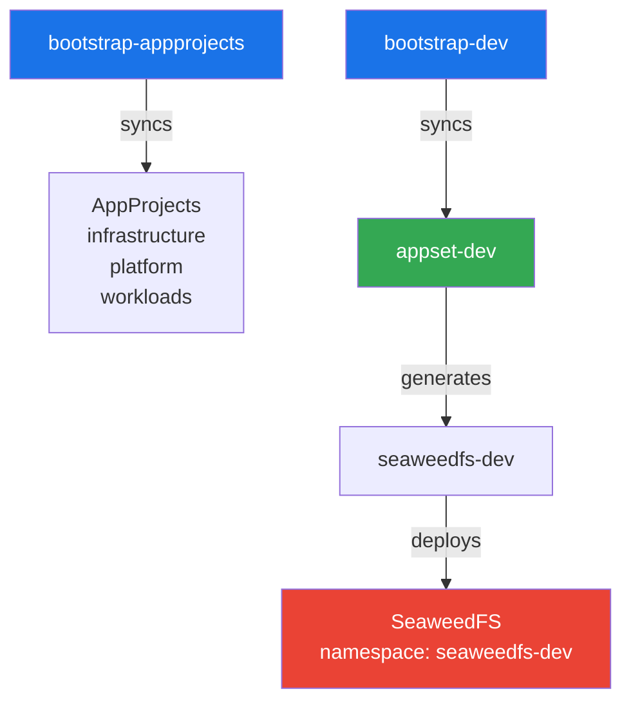

# lake-argocd-iac

ArgoCD GitOps repository for a datalake/lakehouse platform on Kubernetes, using the app-of-apps pattern with ApplicationSets.

## Architecture



The bootstrap layer (AppProjects) and environment layer (ApplicationSets) are plain ArgoCD Applications synced from `apps/bootstrap/`. ApplicationSets generate per-component Applications that deploy Helm charts with environment-specific overrides.

## Repository structure

```
apps/
├── appprojects/                  # Helm chart for AppProject definitions
│   ├── Chart.yaml
│   ├── values.yaml               # Single source of truth
│   └── rendered/                 # Committed Helm output (3 files)
│       ├── infrastructure.yaml
│       ├── platform.yaml
│       └── workloads.yaml
├── bootstrap/                    # ArgoCD Applications (sync wave -10 and 0)
│   ├── appprojects.yaml          # Self-manages the AppProject trio
│   ├── dev.yaml
│   ├── stage.yaml
│   └── prod.yaml
├── dev/                          # ApplicationSet for dev
│   └── appset.yaml
├── stage/                        # ApplicationSet for stage
│   └── appset.yaml
├── prod/                         # ApplicationSet for prod
│   └── appset.yaml
└── values/                       # Per-environment Helm overrides
    └── dev/
        └── seaweedfs.yaml

scripts/
└── render-appprojects.sh         # Regenerates rendered/ from Helm chart

docs/
└── argocd.md                     # ArgoCD install and bootstrap instructions
```

### AppProjects

Three ArgoCD AppProjects categorize workloads by function:

| Project | Scope |
|---|---|
| `infrastructure` | Object storage, networking, ingress, monitoring, certificates |
| `platform` | PostgreSQL, Redis, Kafka, secrets (shared data layer) |
| `workloads` | Airflow, Trino, Spark, Nessie, Metabase, Superset, JupyterHub |

### Bootstrap flow

```text
bootstrap-appprojects ─► AppProjects (infrastructure/platform/workloads)
       │
       ▼
bootstrap-dev ─► appset-dev ─► seaweedfs-dev
```

## Prerequisites

- Kubernetes cluster (tested on microk8s via WSL)
- ArgoCD installed on the cluster (see [docs/argocd.md](docs/argocd.md))
- `kubectl` configured for the cluster

## Getting started

```bash
# 1. Create AppProjects
kubectl apply -f apps/bootstrap/appprojects.yaml

# 2. Bootstrap dev environment
kubectl apply -f apps/bootstrap/dev.yaml

# 3. Monitor progress
kubectl get application -n argocd -w
```

ArgoCD auto-syncs and deploys SeaweedFS into the `seaweedfs-dev` namespace.

### Accessing services

```bash
# Port-forward individual components
kubectl port-forward -n seaweedfs-dev svc/seaweedfs-filer 8888:8888
kubectl port-forward -n seaweedfs-dev svc/seaweedfs-master 9333:9333
kubectl port-forward -n seaweedfs-dev svc/seaweedfs-admin 23646:23646
kubectl port-forward -n seaweedfs-dev svc/seaweedfs-s3 8333:8333
```

| Component | URL |
|---|---|
| Filer UI | http://localhost:8888 |
| Master UI | http://localhost:9333/cluster/status |
| Admin UI | http://localhost:23646 |
| S3 API | http://localhost:8333 |

## Adding a new component

1. Add the element to `apps/{env}/appset.yaml` generators list
2. Create `apps/values/{env}/{component}.yaml` with Helm overrides
3. Commit and push — ArgoCD auto-syncs

## Environment model

| Environment | Namespace pattern | Cluster |
|---|---|---|
| `dev` | `{component}-dev` | microk8s (single-node) |
| `stage` | `{component}-stage` | microk8s (single-node) |
| `prod` | `{component}-prod` | microk8s (single-node) |

Each environment has its own ApplicationSet and values directory. Stub files exist for `stage` and `prod`; add elements to their generators when ready.

## Updating AppProjects

Edit `apps/appprojects/values.yaml`, then regenerate the rendered files:

```bash
bash scripts/render-appprojects.sh
```

Commit the rendered changes — ArgoCD picks them up automatically.

## Development

This project uses ArgoCD ServerSideApply for resource reconciliation. Sync options are tuned for pre-production: prune is disabled and self-heal is enabled.
