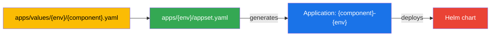

# Adding a new application

This guide walks through adding a new component to the datalake platform. Every component follows the same path: define a value override file, register it in the ApplicationSet, commit, and let ArgoCD deploy.

## Understanding the flow



Each environment (`dev`, `stage`, `prod`) has an ApplicationSet (`apps/{env}/appset.yaml`) that lists every component for that environment. The ApplicationSet generates one ArgoCD Application per component, which then deploys a Helm chart into its own namespace.

## Step-by-step

### 1. Choose a Helm chart

Find the upstream Helm chart you want to deploy. The chart repository must be added to `sourceRepos` in `apps/appprojects/values.yaml`. Currently allowed:

- `https://github.com/neriberto/lakeops`
- `https://seaweedfs.github.io/seaweedfs/helm`

If your chart comes from a different repository, add it:

```yaml
# apps/appprojects/values.yaml
sourceRepos:
  - https://github.com/neriberto/lakeops
  - https://seaweedfs.github.io/seaweedfs/helm
  - https://charts.bitnami.com/bitnami          # example
```

Then regenerate and commit the AppProjects:

```bash
bash scripts/render-appprojects.sh
```

### 2. Create the values file

Create `apps/values/{env}/{component}.yaml` with your Helm overrides. Start from the upstream chart's default values and override only what differs.

```bash
touch apps/values/dev/postgresql.yaml
```

### 3. Register in the ApplicationSet

Edit `apps/{env}/appset.yaml` and add a new element to the `generators[0].list.elements` array.

### 4. Commit and push

```bash
git add -A
git commit -m "feat: add {component} to {env}"
git push
```

### 5. Monitor

ArgoCD auto-syncs. Watch the new Application and its resources:

```bash
kubectl get application -n argocd -w | grep {component}
kubectl get all -n {component}-{env}
```

## Examples

### Example A: CloudNativePG PostgreSQL

Add the cluster data layer as a `platform` AppProject dependency for `dev`. The platform data layer follows an operator + `Cluster` CR pattern rather than the generic Helm-chart-on-values-file pattern of the rest of this guide; the architectural decision and the chart/version pinning contract live in [ADR-0009](adr/0009-cloudnative-pg-for-platform-data-layer.md) and [SPEC-0006](specs/0006-cloudnative-pg-pinning-and-cluster-cr-contract.md). The operator install is already managed by the `cloudnative-pg` generator element of `apps/dev/appset.yaml`; this example only adds the `Cluster` CR and the standalone ArgoCD `Application` that reconciles it.

**1. Verify the operator is installed.**

The appset's `cloudnative-pg` element at `apps/dev/appset.yaml` deploys the operator chart at `version: 0.29.0` with `project: infrastructure`, `namespace: cloudnative-pg-dev`, `syncWave: -2`. Confirm via:

```bash
kubectl get application -n argocd cloudnative-pg-dev
```

The expected output is `Synced/Healthy`. The controller deployment lives in the `cloudnative-pg-dev` namespace:

```bash
kubectl get deployment -n cloudnative-pg-dev cnpg-controller-manager
```

If the controller is not `Available`, the next step will produce a `Cluster` CR with no operator to reconcile — fix the operator install first.

**2. Create the Cluster CR.**

The `Cluster` custom resource is what the operator turns into the actual StatefulSet + Service + Secret + PVC stack. The version of the PostgreSQL container is pinned via `spec.postgresqlVersion` per [SPEC-0006](specs/0006-cloudnative-pg-pinning-and-cluster-cr-contract.md). File at `apps/cloudnative-pg/clusters/postgresql.yaml`:

```yaml
# apps/cloudnative-pg/clusters/postgresql.yaml
# The platform's `dev` PostgreSQL Cluster CR, deployed via ArgoCD.
# See ADR-0009 for the architectural decision and SPEC-0006 for the
# pinning contract. Per-environment values live at
# apps/values/dev/postgresql.yaml as a sibling documentation file
# (ArgoCD does not consume it; it's the contract).
# ----------------------------------------------------------------------------
apiVersion: postgresql.cnpg.io/v1
kind: Cluster
metadata:
  name: postgresql-dev
  namespace: cloudnative-pg-dev
  labels:
    app.kubernetes.io/part-of: lake
    app.kubernetes.io/component: data-layer
    lake.io/environment: dev
spec:
  instances: 1
  postgresqlVersion: "17"

  primaryUpdateStrategy: unsupervised

  enableSuperuserAccess: false

  storage:
    size: 8Gi
    # storageClass intentionally empty (uses cluster default —
    # gp2 on EKS, standard on GKE, microk8s-hostpath on microk8s,
    # local-path on k3s).

  resources:
    requests:
      memory: 256Mi
      cpu: 250m

  monitoring:
    enabled: false

  bootstrap:
    initdb:
      database: lake
      owner: lake
      secret:
        name: postgresql-credentials
```

The `spec.instances: 1` keeps `dev` single-pod (production HA — 3 instances + replication slots — is a per-env config item deferred to RFC-0004). `spec.postgresqlVersion: "17"` pins the PostgreSQL major per SPEC-0006. `spec.bootstrap.initdb` creates the `lake` database and the `lake` owner user on first apply; the operator reads the `lake` user's password from the `Secret` named `postgresql-credentials`, which the Sealed Secrets controller (Track C, per ADR-0008) renders. `spec.monitoring.enabled: false` keeps the Prometheus `PodMonitor` off in `dev` (no Prometheus Operator is installed today); `spec.enableSuperuserAccess: false` removes the `postgres` superuser so `lake` is the highest-privileged user.

**3. Create the standalone Application.**

This Application is *not* a generator element of `appset-dev`; it is a standalone ArgoCD resource applied once via `kubectl apply -f` (step 4). The Application uses ArgoCD's `path:` source — which points at a directory in this repo — to reconcile the `Cluster` CR as a plain manifest; no Helm templating is involved. File at `apps/cloudnative-pg/clusters/application.yaml`:

```yaml
# apps/cloudnative-pg/clusters/application.yaml
# ArgoCD Application that deploys the postgresql-dev Cluster CR.
# Standalone (not generated by appset) because the source is a
# plain path in this repo, not a Helm chart.
# ----------------------------------------------------------------------------
apiVersion: argoproj.io/v1alpha1
kind: Application
metadata:
  name: postgresql-dev
  namespace: argocd
  labels:
    app.kubernetes.io/part-of: lake
    app.kubernetes.io/component: data-layer
    lake.io/environment: dev
  annotations:
    argocd.argoproj.io/sync-wave: "-1"
spec:
  project: platform
  sources:
    - repoURL: https://github.com/neriberto/lakeops
      targetRevision: main
      path: apps/cloudnative-pg/clusters
      # `path:` is a directory. ArgoCD reads every *.yaml in the
      # directory as a manifest, applies the ones whose `kind: Cluster`
      # matches the watch filter on the namespace.
  destination:
    server: https://kubernetes.default.svc
    namespace: cloudnative-pg-dev
  syncPolicy:
    automated:
      prune: false
      selfHeal: true
      allowEmpty: false
    syncOptions:
      - CreateNamespace=true
      - ServerSideApply=true
      - ApplyOutOfSyncOnly=true
```

The `path: apps/cloudnative-pg/clusters` field points at a directory, not a single file. ArgoCD reads every `*.yaml` in the directory and applies whichever manifest types it recognizes — in this case the `Cluster` CR in the sibling `postgresql.yaml`. The standalone `Application` declares `project: platform` (per ADR-0003, the data layer is platform-tier) and `destination.namespace: cloudnative-pg-dev` (where the operator install put the controller); `CreateNamespace=true` is harmless because the namespace already exists by the time the standalone Application reconciles.

**4. Register the standalone Application.**

The standalone Application is registered with a one-shot `kubectl apply -f`, **not** by editing `apps/bootstrap/dev.yaml` (which carries the appset bootstrap and is unchanged from the appset-for-dev pattern). Run once after the file commits:

```bash
kubectl apply -f apps/cloudnative-pg/clusters/application.yaml
```

ArgoCD now owns the `postgresql-dev` `Application` resource and reconciles it automatically — the `syncPolicy.automated.selfHeal: true` setting brings any drift back to the committed state, and the path-source triggers auto-sync on subsequent edits. Do **not** also add the same Application as a bootstrap entry; ArgoCD will see two `Application` resources with the same `metadata.name` and the project/namespace of whichever it picks first wins. The single registration is the source of truth.

**5. Per-environment contract file.**

The ArgoCD-rendered `Cluster` CR is the source of truth at apply time; the file at `apps/values/dev/postgresql.yaml` documents the intended per-environment configuration for humans and future automation. It is **not consumed by ArgoCD today** — it is a documentation-of-intent sibling that mirrors the CR shape from step 2 so the values-file pattern from [SPEC-0003](specs/0003-adding-a-new-component.md) is preserved. Future automation tooling (a re-introduced Helm wrapper, a generator-element for the `Cluster` CR) could parse it. File at `apps/values/dev/postgresql.yaml`:

```yaml
# apps/values/dev/postgresql.yaml
# Per-environment values for the CloudNativePG wrapper chart at
# apps/cloudnative-pg/postgresql/. This file overrides the chart's defaults
# for the `dev` environment only; `stage` and `prod` will have their own
# overrides under apps/values/{stage,prod}/postgresql.yaml when those
# environments activate.
#
# The wrapper chart consumes these values via the standard ApplicationSet
# `valueFiles` path ($values/apps/values/dev/{{ .chart }}.yaml). The
# `chart:` element in the appset is `postgresql`, matching the wrapper
# chart's name.
# ----------------------------------------------------------------------------

# Cluster identity
cluster:
  name: postgresql-dev
  namespace: cloudnative-pg-dev
  instances: 1
  postgresqlVersion: "17"

# Storage (per-environment override)
storage:
  size: 8Gi
  # storageClass intentionally empty (inherits cluster default —
  # gp2 on EKS, standard on GKE, microk8s-hostpath on microk8s,
  # local-path on k3s).

# Resources (per-environment override)
resources:
  requests:
    memory: 256Mi
    cpu: 250m

# Bootstrap / database / users
database: lake
owner: lake
# SealedSecret-derived `Secret` named `postgresql-credentials`
# carries the `lake` user credentials. Admin password uses the
# same Secret. Per ADR-0008 and the helm-secrets follow-up;
# Track C (operator install) is what populates the Secret.
existingSecret: postgresql-credentials

# Operational settings
enableSuperuserAccess: false
primaryUpdateStrategy: unsupervised
monitoring:
  enabled: false
```

**6. Verify on cluster.**

Three `kubectl` commands confirm the on-cluster end state. All target the `cloudnative-pg-dev` namespace (where the operator install put the controller and where the `Cluster` CR's `metadata.namespace` lands):

```bash
kubectl get application -n argocd postgresql-dev          # Synced/Healthy
kubectl get cluster -A -l app.kubernetes.io/part-of=lake   # READY=True
kubectl get pods -n cloudnative-pg-dev -l cnpg.io/cluster=postgresql-dev \
  -o jsonpath='{.items[*].spec.containers[0].image}'     # ghcr.io/cloudnative-pg/postgresql:17-*
```

The Application reconciles the `Cluster` CR into the `cloudnative-pg-dev` namespace (`CreateNamespace=true`). The CloudNativePG operator watches the CR cluster-wide and creates the underlying StatefulSet + Service + Secret + PVC stack. The primary pod's image is determined by `postgresqlVersion` (pinned as `"17"`) plus the operator's `appVersion` — if the image tag reports a different major version, the pinning contract in [SPEC-0006](specs/0006-cloudnative-pg-pinning-and-cluster-cr-contract.md) has drifted.

The rationale for adopting CloudNativePG over the Bitnami `postgresql` chart is recorded in [ADR-0009](adr/0009-cloudnative-pg-for-platform-data-layer.md), which supersedes [ADR-0007](adr/0007-bitnami-postgresql-chart-for-platform-foundation.md). The pinning contract for the operator chart version, the Postgres major version, and the upgrade playbook live in [SPEC-0006](specs/0006-cloudnative-pg-pinning-and-cluster-cr-contract.md).

### Example B: Trino

Add Trino (distributed SQL query engine) as a datalake workload for dev.

**1. Enable the Trino Helm repository in AppProjects**

```yaml
# apps/appprojects/values.yaml
sourceRepos:
  - https://github.com/neriberto/lakeops
  - https://seaweedfs.github.io/seaweedfs/helm
  - https://trino.io/charts
```

Re-render:

```bash
bash scripts/render-appprojects.sh
```

**2. Create the values file**

```yaml
# apps/values/dev/trino.yaml
image:
  tag: "456"
coordinator:
  resources:
    requests:
      memory: 1Gi
      cpu: 500m
worker:
  replicas: 1
  resources:
    requests:
      memory: 2Gi
      cpu: 1
additionalCatalogs:
  lake:
    - connector.name=iceberg
    - hive.metastore.uri=thrift://nessie:19098
    - iceberg.catalog.type=nessie
    - iceberg.nessie-catalog.uri=http://nessie:19120/api/v1
```

**3. Register in the ApplicationSet**

```yaml
# apps/dev/appset.yaml
spec:
  generators:
    - list:
        elements:
          - chart: seaweedfs
            namespace: seaweedfs-dev
            project: infrastructure
            syncWave: -2
          - chart: trino
            namespace: trino-dev
            project: workloads    # datalake workload
            syncWave: 2
```

## Field reference

Each element in the ApplicationSet generator supports these fields:

| Field | Required | Description |
|---|---|---|
| `chart` | yes | Helm chart name, also used in the Application name (`{chart}-{env}`) |
| `namespace` | yes | Target Kubernetes namespace (`{component}-{env}` convention) |
| `project` | yes | ArgoCD AppProject: `infrastructure`, `platform`, or `workloads` |
| `syncWave` | no | ArgoCD sync wave for ordering dependencies (negative = earlier) |

Note: the `chart:` field on a generator element is `cloudnative-pg` for the operator install pattern; `path:` on a standalone Application (under `apps/cloudnative-pg/clusters/`) is the alternative for direct `Cluster` CR deployment.

## Choosing the right AppProject

| Category | Project | Examples |
|---|---|---|
| Storage and networking | `infrastructure` | SeaweedFS, Nginx Ingress, MetalLB, cert-manager |
| Shared data layer | `platform` | PostgreSQL, Redis, Kafka, Vault, Keycloak |
| Datalake workloads | `workloads` | Airflow, Trino, Spark, Nessie, Metabase, Superset, JupyterHub |

## Troubleshooting

### Application stuck at Missing or Unknown

```bash
argocd app get {component}-{env}
```

Check that the AppProject exists and allows the source repository and destination namespace.

### Chart not found

Verify the chart repository is in `sourceRepos` and the chart name is correct. Test locally:

```bash
helm repo add {name} {url}
helm search repo {name}/{chart}
```

### PVC pending

```bash
kubectl describe pvc -n {component}-{env}
```

Check that the `storageClass` exists on the cluster. If the chart's `storageClass` is unset or empty, the cluster's default StorageClass is used — list available classes with `kubectl get storageclass` and confirm at least one is marked `(default)`.
