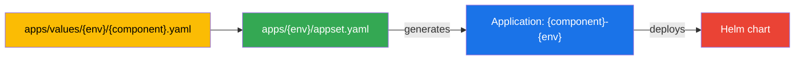

# Adding a new application

This guide walks through adding a new component to the datalake platform. Every component follows the same path: define a value override file, register it in the ApplicationSet, commit, and let ArgoCD deploy.

## Understanding the flow



Each environment (`dev`, `stage`, `prod`) has an ApplicationSet (`apps/{env}/appset.yaml`) that lists every component for that environment. The ApplicationSet generates one ArgoCD Application per component, which then deploys a Helm chart into its own namespace.

## Step-by-step

### 1. Choose a Helm chart

Find the upstream Helm chart you want to deploy. The chart repository must be added to `sourceRepos` in `apps/appprojects/values.yaml`. Currently allowed:

- `https://github.com/neriberto/lakeops`
- `https://seaweedfs.github.io/seaweedfs/helm`

If your chart comes from a different repository, add it:

```yaml
# apps/appprojects/values.yaml
sourceRepos:
  - https://github.com/neriberto/lakeops
  - https://seaweedfs.github.io/seaweedfs/helm
  - https://charts.bitnami.com/bitnami          # example
```

Then regenerate and commit the AppProjects:

```bash
bash scripts/render-appprojects.sh
```

### 2. Create the values file

Create `apps/values/{env}/{component}.yaml` with your Helm overrides. Start from the upstream chart's default values and override only what differs.

```bash
touch apps/values/dev/postgresql.yaml
```

### 3. Register in the ApplicationSet

Edit `apps/{env}/appset.yaml` and add a new element to the `generators[0].list.elements` array.

### 4. Commit and push

```bash
git add -A
git commit -m "feat: add {component} to {env}"
git push
```

### 5. Monitor

ArgoCD auto-syncs. Watch the new Application and its resources:

```bash
kubectl get application -n argocd -w | grep {component}
kubectl get all -n {component}-{env}
```

## Examples

### Example A: Bitnami PostgreSQL

Add PostgreSQL as a platform dependency for dev.

**1. Add the Bitnami chart repository to the AppProject allowlist**

```yaml
# apps/appprojects/values.yaml
sourceRepos:
  - https://github.com/neriberto/lakeops
  - https://seaweedfs.github.io/seaweedfs/helm
  - https://charts.bitnami.com/bitnami
```

Re-render:

```bash
bash scripts/render-appprojects.sh
```

**2. Create the values file**

```yaml
# apps/values/dev/postgresql.yaml
auth:
  database: lake
  username: lake
  password: lake-dev
  postgresPassword: admin-dev
primary:
  persistence:
    storageClass: ""           # empty = use cluster default (gp2 on EKS, standard on GKE, microk8s-hostpath on microk8s, local-path on k3s)
    size: 8Gi
  resources:
    requests:
      memory: 256Mi
      cpu: 250m
metrics:
  enabled: false
```

**3. Register in the ApplicationSet**

```yaml
# apps/dev/appset.yaml
spec:
  generators:
    - list:
        elements:
          - chart: seaweedfs
            namespace: seaweedfs-dev
            project: infrastructure
            syncWave: -2
          - chart: postgresql          # new
            namespace: postgresql-dev  # new
            project: platform          # new
            syncWave: -1               # new
```

Note the `project` field: PostgreSQL belongs to the `platform` AppProject because it is a shared data-layer dependency (not infrastructure, not a datalake workload).

**4. The generated Application**

With this element, ArgoCD generates an Application named `postgresql-dev` that:

- Sources the chart from `https://charts.bitnami.com/bitnami`
- Uses the release name `postgresql`
- Reads values from `$values/apps/values/dev/postgresql.yaml`
- Deploys into namespace `postgresql-dev`
- Belongs to AppProject `platform`

### Example B: Trino

Add Trino (distributed SQL query engine) as a datalake workload for dev.

**1. Enable the Trino Helm repository in AppProjects**

```yaml
# apps/appprojects/values.yaml
sourceRepos:
  - https://github.com/neriberto/lakeops
  - https://seaweedfs.github.io/seaweedfs/helm
  - https://trino.io/charts
```

Re-render:

```bash
bash scripts/render-appprojects.sh
```

**2. Create the values file**

```yaml
# apps/values/dev/trino.yaml
image:
  tag: "456"
coordinator:
  resources:
    requests:
      memory: 1Gi
      cpu: 500m
worker:
  replicas: 1
  resources:
    requests:
      memory: 2Gi
      cpu: 1
additionalCatalogs:
  lake:
    - connector.name=iceberg
    - hive.metastore.uri=thrift://nessie:19098
    - iceberg.catalog.type=nessie
    - iceberg.nessie-catalog.uri=http://nessie:19120/api/v1
```

**3. Register in the ApplicationSet**

```yaml
# apps/dev/appset.yaml
spec:
  generators:
    - list:
        elements:
          - chart: seaweedfs
            namespace: seaweedfs-dev
            project: infrastructure
            syncWave: -2
          - chart: trino
            namespace: trino-dev
            project: workloads    # datalake workload
            syncWave: 2
```

## Field reference

Each element in the ApplicationSet generator supports these fields:

| Field | Required | Description |
|---|---|---|
| `chart` | yes | Helm chart name, also used in the Application name (`{chart}-{env}`) |
| `namespace` | yes | Target Kubernetes namespace (`{component}-{env}` convention) |
| `project` | yes | ArgoCD AppProject: `infrastructure`, `platform`, or `workloads` |
| `syncWave` | no | ArgoCD sync wave for ordering dependencies (negative = earlier) |

## Choosing the right AppProject

| Category | Project | Examples |
|---|---|---|
| Storage and networking | `infrastructure` | SeaweedFS, Nginx Ingress, MetalLB, cert-manager |
| Shared data layer | `platform` | PostgreSQL, Redis, Kafka, Vault, Keycloak |
| Datalake workloads | `workloads` | Airflow, Trino, Spark, Nessie, Metabase, Superset, JupyterHub |

## Troubleshooting

### Application stuck at Missing or Unknown

```bash
argocd app get {component}-{env}
```

Check that the AppProject exists and allows the source repository and destination namespace.

### Chart not found

Verify the chart repository is in `sourceRepos` and the chart name is correct. Test locally:

```bash
helm repo add {name} {url}
helm search repo {name}/{chart}
```

### PVC pending

```bash
kubectl describe pvc -n {component}-{env}
```

Check that the `storageClass` exists on the cluster. If the chart's `storageClass` is unset or empty, the cluster's default StorageClass is used — list available classes with `kubectl get storageclass` and confirm at least one is marked `(default)`.
