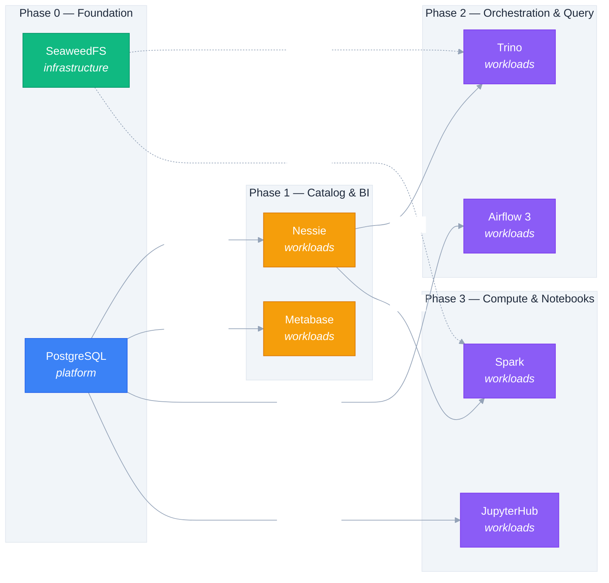

# RFC-0005 — Initial workload rollout sequence

## Status

Proposed

## Date

2026-07-07

## Author(s)

lakeops maintainers

## Motivation

Today the only Application actually deployed is `seaweedfs-dev`. The top-level
`README.md`, the ADRs, and `docs/adding-a-new-application.md` describe a larger
set of components that could go into the platform, but there is no documented
order in which they should be added. Several of the planned components share a
hard dependency on PostgreSQL — Metabase, Nessie, and Airflow all need a
relational metadata store. Installing them before PostgreSQL would force
per-component workarounds (SQLite, embedded H2, in-memory) that would later be
replaced, churning `apps/values/dev/*` files and risking data loss on the
cutover. A documented rollout sequence makes the dependency graph explicit and
keeps every phase independently committable.

## Proposal

A four-phase rollout for the initial datalake workload set in `dev`. Each
phase is replicated into `stage` and `prod` per [RFC-0003](0003-env-promotion-path.md)
once it is stable in `dev`. Within each phase, a single ApplicationSet
(`apps/dev/appset.yaml`) carries all elements; `syncWave` annotations enforce
the order on every reconciliation.

### Storage

SeaweedFS is the only object-storage option in the platform. **MinIO is
explicitly out of scope** — the platform standardizes on SeaweedFS for
S3-compatible storage, and the `infrastructure` AppProject example lists only
SeaweedFS. Do not add MinIO charts to `apps/appprojects/values.yaml`
`sourceRepos`; doing so would expand the attack surface for no functional gain.

### Rollout sequence at a glance

The diagram below shows every planned Application, its AppProject category,
its rollout phase, and its dependency edges. **Solid arrows** are hard runtime
dependencies ("if X is down, Y cannot work"); **dashed arrows** are data-flow
relationships ("Y reads or writes its data into X"). SeaweedFS is the only
node already deployed today; everything else is `Proposed` and follows the
phase order.

### Phase 0 — Foundation: PostgreSQL

- **AppProject:** `platform`
- **Namespace:** `postgresql-dev`
- **Chart:** Bitnami PostgreSQL (Helm repo `https://charts.bitnami.com/bitnami`)
- **Justification:** Every analytics workload in Phase 1+ needs a relational
  metadata store. Installing PostgreSQL first is the lowest-risk foundation:
  all later phases are guaranteed to find a real Postgres to connect to.
- **Blocked by:** nothing.
- **Blocks:** Nessie, Metabase, Airflow, JupyterHub, Superset (everything
  downstream that needs SQL metadata).
- **Sync wave:** `-1` (after SeaweedFS at `-2`, before everything else).

### Phase 1 — Catalog and BI: Nessie + Metabase

These can be installed in parallel because they share only the PostgreSQL
dependency from Phase 0; they do not depend on each other.

- **Nessie** (`workloads`, namespace `nessie-dev`): datalake catalog with
  branch / tag / commit semantics. Stores its catalog metadata in PostgreSQL.
  Becomes the Iceberg catalog that Trino and Spark consume in Phase 2.
- **Metabase** (`workloads`, namespace `metabase-dev`): BI surface. Stores its
  own application metadata in PostgreSQL. Configured to query data sources
  as they come online.
- **Blocked by:** Phase 0 (PostgreSQL).
- **Blocks:** Trino (Phase 2) needs Nessie as its catalog; Spark (Phase 3) also
  benefits from a stable Nessie endpoint.
- **Sync wave:** `1` (after Phase 0, before Phase 2).

### Phase 2 — Orchestration and query: Airflow 3 + Trino

- **Airflow v3** (`workloads`, namespace `airflow-dev`): orchestrator. Uses
  PostgreSQL as its metadata DB — Airflow 3 deprecated SQLite as the default
  metadata DB and recommends PostgreSQL even for dev. The Helm chart
  `apache-airflow/airflow` ships with PostgreSQL support out of the box; the
  ExecutorScheduler relationship in v3 requires PostgreSQL (no standalone
  metadata DB alternative is supported). See `docs/adding-a-new-application.md`
  for the values-file pattern; specify the existing `postgresql-dev` Service
  in the airflow values file rather than deploying a sidecar Postgres.
- **Trino** (`workloads`, namespace `trino-dev`): distributed SQL query
  engine. Configured with Nessie as the Iceberg catalog (see the worked
  Trino example in `docs/adding-a-new-application.md` §Example B).
- **Blocked by:** Phase 0 (PostgreSQL) directly, and Phase 1 (Nessie) for the
  catalog wiring.
- **Sync wave:** `2`.

### Phase 3 — Compute and notebook surface: Spark + JupyterHub

- **Spark** (`workloads`, namespace `spark-dev`): distributed compute. Reads
  and writes through the Nessie catalog.
- **JupyterHub** (`workloads`, namespace `jupyterhub-dev`): notebook surface
  for data scientists. Authenticates against the same PostgreSQL instance
  (configurable; deferred to RFC-0002 secrets-management decisions).
- **Blocked by:** Phase 1 (Nessie) for Spark; Phase 0 (PostgreSQL) for
  JupyterHub auth.
- **Sync wave:** `3`.

### Deferred (post-MVP)

- **Redis, Kafka** under the `platform` AppProject — streaming and cache
  layers. Needed only once we have streaming ingestion or want to reduce
  PostgreSQL load. Not in the initial MVP.
- **Superset** as an alternative BI surface to Metabase — pick one per
  environment to avoid maintenance overhead. Metabase is the MVP choice;
  revisit if the team needs Superset-specific visualizations.

## Drawbacks

- The phased rollout delays end-user value compared to installing all
  components in parallel. This is offset by avoiding per-component
  workarounds and by keeping every phase a clean atomic commit.
- PostgreSQL becomes a single point of failure for `workloads`. Mitigated by
  per-environment HA in `stage` and `prod` (deferred to RFC-0004 multi-cluster
  work; for `dev` on microk8s single-node, a daily logical backup is enough).
- Adding Bitnami charts means a third Helm repo in the AppProject allowlist.
  The existing render-and-commit pattern handles this with one additional line
  in `apps/appprojects/values.yaml` `sourceRepos` plus a `bash
  scripts/render-appprojects.sh` run.
- Airflow v3 is a recent release; the Helm chart ecosystem is still
  consolidating. We accept the risk of pinning to a specific Airflow chart
  version and tracking upstream releases explicitly.

## Alternatives Considered

- **Install everything in parallel from day one.** Rejected: it forces each
  component to choose between an embedded database (later replaced) or to
  block on PostgreSQL anyway. Net negative.
- **Use SQLite for Airflow metadata in `dev`.** Rejected: Airflow 3 deprecated
  this and the chart refuses to start with SQLite. Diverging from `prod` for
  a tooling-only saving is not worth the support cost.
- **Stand up an embedded Postgres per workload** (CloudNativePG or similar
  inside each namespace). Rejected: it duplicates operational work, defeats
  the purpose of a shared `platform` AppProject, and creates backup sprawl.
- **MinIO as a second object-storage option.** Rejected by product decision;
  SeaweedFS is the chosen storage. The MinIO chart should not be added to
  the AppProject allowlist.
- **Per-phase ApplicationSets** (`appset-dev-phase-0.yaml`, etc.). Rejected:
  `syncWave` annotations within a single appset provide the same ordering
  guarantee with one fewer bootstrap Application to maintain.

## Open Questions

- **Superset vs Metabase** — single source of truth, or both? Recommendation:
  Metabase for now, defer Superset. Confirm before Phase 1 lands.
- **Redis / Kafka** — needed in the initial MVP, or Phase 4+?
  Recommendation: Phase 4+. Confirm.
- **PostgreSQL operator** — Bitnami chart, Zalando postgres-operator, or
  CloudNativePG? Recommendation: Bitnami for `dev` simplicity; revisit for
  `stage` / `prod` HA requirements in RFC-0004.
- **Airflow executor** — CeleryExecutor (needs Redis/RabbitMQ) vs
  KubernetesExecutor (no extra infra) vs CeleryKubernetesExecutor (mixed).
  Recommendation: KubernetesExecutor in `dev` to avoid pulling in Redis as a
  hard dependency; revisit for `prod` if scheduler latency demands it.

## References

- [ADR-0003](../adr/0003-three-tier-categorization.md) — three-tier
  categorization places PostgreSQL in `platform`, the rest in `workloads`.
- [ADR-0005](../adr/0005-per-environment-applicationsets.md) — per-environment
  ApplicationSets; each phase is replicated per env via a new generator
  element in `apps/{dev,stage,prod}/appset.yaml`.
- [SPEC-0003](../specs/0003-adding-a-new-component.md) — the workflow used
  to register each component.
- [RFC-0002](0002-secrets-management.md) — PostgreSQL credentials and
  Airflow's metadata-DB connection strings flow through the same secrets
  strategy.
- [RFC-0003](0003-env-promotion-path.md) — the phased rollout is replicated
  across `dev` → `stage` → `prod` once stable.
- [RFC-0004](0004-multi-cluster-progression.md) — multi-cluster HA is the
  eventual answer for PostgreSQL resilience in `prod`.
- [`docs/adding-a-new-application.md`](../adding-a-new-application.md) —
  worked examples for Bitnami PostgreSQL (§Example A) and Trino with Nessie
  catalog (§Example B); reuse these as the starting point for each phase.