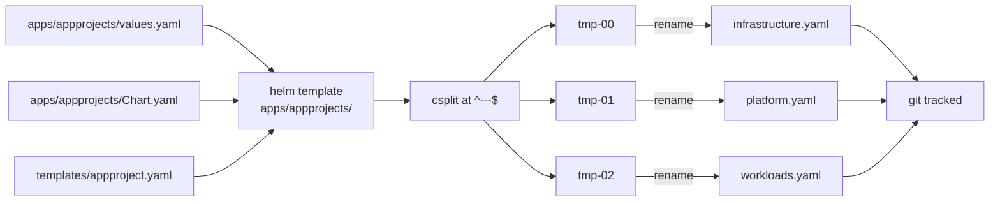

## Title

AppProject Helm chart and rendered output contract

> **Status:** Implemented
>
> **Date:** 2026-07-07
>
> **Author(s):** lakeops maintainers

## Overview

The lakeops platform defines its three ArgoCD AppProjects
(`infrastructure`, `platform`, `workloads`) from a single source of truth: a
small Helm chart at `apps/appprojects/`. The chart's only varying inputs are
each project's `name` and `description`; every other field — `sourceRepos`,
`destinations`, `clusterResourceWhitelist`, `namespaceResourceWhitelist`, and
`orphanedResources` — is shared by construction.

`scripts/render-appprojects.sh` runs `helm template` against that chart and
splits the output at `---` boundaries into three files under
`apps/appprojects/rendered/` (one per AppProject). The `rendered/` tree is
**committed** to the repository so ArgoCD can apply plain YAML directly,
without invoking Helm at sync time.

A pre-commit hook re-runs the script on every change to the chart source, and
a GitHub Actions job (`drift-check`) re-runs it on every push and pull
request. The two layers together prevent the rendered files from drifting out
of sync with `values.yaml`. Drift between AppProjects themselves is
structurally impossible because every project is rendered from the same
template.

## Architecture

The dataflow runs from chart source to committed rendered output in four
steps.



The chart iterates over `.Values.projects` (a list of three entries) and
emits one AppProject per entry, separated by the YAML document marker
`---`. The split is positional: the script trusts the order of
`.Values.projects` to map a split suffix to an AppProject name. Reordering
`.Values.projects` without updating the `NAMES` map in the script is a silent
break — the names still point at the same files, but the rendered AppProject
labels no longer match the file names. The CI drift check catches the values
side of this; it does not currently catch a positional mismatch.

## Components

| File | Role |
| --- | --- |
| `apps/appprojects/Chart.yaml` | Helm chart metadata. `apiVersion: v2`, `name: appprojects`, `type: application`, `kubeVersion: ">=1.24.0-0"`. The chart description documents the render command and the rationale for committing the rendered output. |
| `apps/appprojects/values.yaml` | Single source of truth. Declares `sourceRepos`, `destinations`, both RBAC whitelists, `orphanedResources`, and the `projects` list. The `destinations` block is intentionally not keyed per project (RFC-0001 §D4.6) so all three AppProjects share an identical allowlist. |
| `apps/appprojects/templates/appproject.yaml` | Helm template. Iterates over `.Values.projects` with `range` and emits one `AppProject` per entry. All other fields are rendered from the top-level values via `toYaml` and `nindent`. |
| `scripts/render-appprojects.sh` | Render orchestrator. Runs `helm template` + `csplit`, then renames the split files using a `NAMES` map keyed by suffix. `set -euo pipefail` so any failure aborts immediately. |
| `apps/appprojects/rendered/infrastructure.yaml` | Committed render of the `infrastructure` AppProject. Applied by ArgoCD from the bootstrap Application. |
| `apps/appprojects/rendered/platform.yaml` | Committed render of the `platform` AppProject. |
| `apps/appprojects/rendered/workloads.yaml` | Committed render of the `workloads` AppProject. |

The render script and the rendered files are the two halves of a deliberate
"render once, commit, apply" pipeline. ArgoCD never runs Helm; the file it
applies is byte-identical to what the script wrote during development.

## Implementation

The render pipeline is a single shell function. It runs `helm template`
against the chart, scoped to the `appproject.yaml` template, then feeds the
output to `csplit` to break it at every `---` document marker. The
positional `NAMES` map then renames the split files to their final names.

The `helm template` invocation is:

```bash
helm template "${CHART_DIR}" -s templates/appproject.yaml
```

The chart-level context is `.Values` (no explicit values file, so Helm reads
`values.yaml` from the chart directory). The `-s` flag restricts output to
the single named template.

The split is positional and depends on the order of `.Values.projects`:

| Suffix | AppProject |
| --- | --- |
| `tmp-00` | `infrastructure` |
| `tmp-01` | `platform` |
| `tmp-02` | `workloads` |

The script uses `csplit -sz -f "${OUTPUT_DIR}/tmp-" --suffix-format='%02d'
- '/^---$/' '{*}'` to split at every `---` line, suppress matching-line
output (`-s`), and produce zero-padded suffix names (`%02d`). The `{*}`
repeat marker tells `csplit` to split on every match instead of only the
first.

`apps/bootstrap/appprojects.yaml` reconciles the three committed
`rendered/*.yaml` files directly. Its `source` block sets
`path: apps/appprojects/rendered` and a `directory.include` of
`{infrastructure,platform,workloads}.yaml`, so ArgoCD applies exactly those
three files and nothing else in the directory.

## Verification

The contract is testable. The following conditions must hold.

Running the render script produces no diff against the committed files:

```bash
bash scripts/render-appprojects.sh
git diff --exit-code --stat apps/appprojects/rendered/
```

A non-zero exit code or any diff output means the source drifted without a
re-render. This is the same check the CI `drift-check` job runs.

The chart lints clean and the rendered output passes schema validation:

```bash
helm lint apps/appprojects/
helm template apps/appprojects/ -s templates/appproject.yaml \
  | kubeconform -strict -summary -ignore-missing-schemas
```

The first command catches template syntax errors, missing required fields,
and malformed `toYaml` output. The second command validates every emitted
`AppProject` against the ArgoCD CRD schema.

The three rendered files are structurally identical apart from `name` and
`description`:

```bash
diff <(grep -v 'name: \|description: ' apps/appprojects/rendered/infrastructure.yaml) \
     <(grep -v 'name: \|description: ' apps/appprojects/rendered/platform.yaml)
```

This is an "anti-drift" check: any diff in the rest of the file means a
shared field is no longer being shared.

## Known state

The committed `apps/appprojects/rendered/*.yaml` files currently contain a
single `destinations` entry, while
[`apps/appprojects/values.yaml`](../../apps/appprojects/values.yaml) declares
three duplicate entries (one per environment — dev, stage, prod). The
single-entry rendered output is the older shape; the three-entry values
block was added to keep the cluster URLs explicit so the future multi-cluster
migration becomes a value change rather than a structural change.

This drift is recorded here rather than silently fixed. The two valid
resolutions are:

1. Collapse `values.yaml` `destinations` to a single entry to match the
   committed rendered output.
2. Re-render to bring the committed `rendered/` files up to three entries.

[RFC-0001](../rfc/0001-destination-allowlist-uniformity.md) §Proposal item 2
codifies the long-term shape (a named `clusters` map referenced by
`destinations`). The fix is a separate code PR and is out of scope for this
documentation-only change.

## References

- [ADR-0001 — AppProjects generated from a Helm chart with committed `rendered/` manifests](../adr/0001-appprojects-helm-rendered.md)
- [ADR-0004 — Explicit `destinations` and tightened RBAC whitelists](../adr/0004-defense-in-depth-appproject-config.md)
- [RFC-0001 — Destination allowlist uniformity across AppProjects](../rfc/0001-destination-allowlist-uniformity.md)
- [SPEC-0004 — CI drift detection and pre-commit enforcement](0004-ci-drift-detection-and-precommit.md)
- [`apps/appprojects/values.yaml`](../../apps/appprojects/values.yaml)
- [`apps/appprojects/Chart.yaml`](../../apps/appprojects/Chart.yaml)
- [`apps/appprojects/templates/appproject.yaml`](../../apps/appprojects/templates/appproject.yaml)
- [`scripts/render-appprojects.sh`](../../scripts/render-appprojects.sh)
- [`apps/appprojects/rendered/`](../../apps/appprojects/rendered/)
- [`apps/bootstrap/appprojects.yaml`](../../apps/bootstrap/appprojects.yaml)
