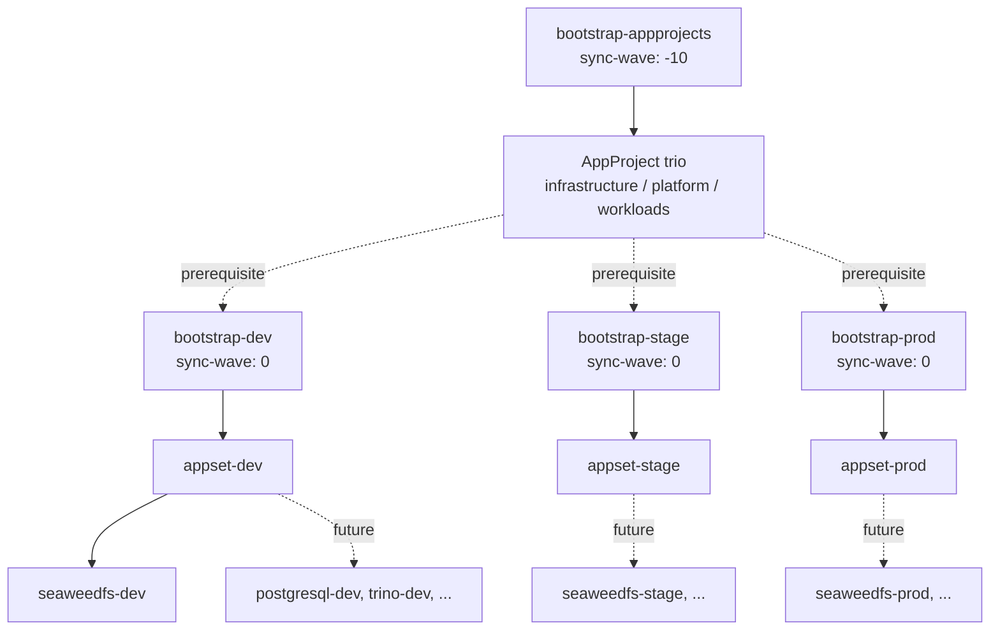

## Title

Bootstrap flow and sync-wave ordering

> **Status:** Implemented
>
> **Date:** 2026-07-07
>
> **Author(s):** lakeops maintainers

## Overview

The `apps/bootstrap/` directory holds four plain ArgoCD `Application`
manifests that drive every other resource in the cluster. The first manifest
(`bootstrap-appprojects`) creates the three AppProjects that gate every
downstream Application. The remaining three (`bootstrap-dev`, `bootstrap-stage`,
`bootstrap-prod`) each create one environment's ApplicationSet, which in
turn generates the per-component `Application` resources that actually deploy
Helm charts.

The manifests use ArgoCD's sync-wave annotation to encode the order in YAML
rather than relying on the order of `kubectl apply` invocations. The
AppProject Application runs at sync wave `-10`; the three environment
Applications run at wave `0`. A reconciliation that touches both layers
applies the AppProject trio first, then creates the per-environment
ApplicationSets.

## Architecture

The first-run apply order and the wave-based reconciliation converge on the
same final topology.



On the first run, the operator applies the four manifests in the listed
order. On every subsequent reconciliation, ArgoCD sorts the Applications by
sync wave and applies wave `-10` before wave `0`. Component-level
`Application`s emitted by each ApplicationSet carry their own
`argocd.argoproj.io/sync-wave` annotation, so intra-environment ordering
(storage before workloads) is expressed inside the generator template.

## Components

| File | Sync wave | Source path | Project | Notes |
| --- | --- | --- | --- | --- |
| `apps/bootstrap/appprojects.yaml` | `-10` | `apps/appprojects/rendered` | `default` | Reconciles the three rendered AppProject manifests with `directory.include: '{infrastructure,platform,workloads}.yaml'`. `prune: true`, `selfHeal: true`. |
| `apps/bootstrap/dev.yaml` | `0` | `apps/dev/` | `default` | Reconciles `appset-dev`. `prune: false`, `selfHeal: true`. `CreateNamespace=true` so per-component namespaces are auto-created. |
| `apps/bootstrap/stage.yaml` | `0` | `apps/stage/` | `default` | Reconciles `appset-stage`. Same sync options as `bootstrap-dev`. |
| `apps/bootstrap/prod.yaml` | `0` | `apps/prod/` | `default` | Reconciles `appset-prod`. Same sync options as `bootstrap-dev`. |

All four manifests share a fixed set of `syncOptions`:

- `ServerSideApply=true` — every resource uses Kubernetes server-side apply,
  which keeps field ownership explicit and survives partial-failure
  reconciliation.
- `CreateNamespace=true` (on the three environment Applications only) —
  auto-creates the per-component namespace on first sync.
- `ApplyOutOfSyncOnly=true` (on the three environment Applications only) —
  limits the diff to resources that ArgoCD considers out of sync, which
  keeps re-syncs small and reviewable.

`bootstrap-appprojects` uses `prune: true` because a removed
AppProject should be removed from the cluster; the environment Applications
use `prune: false` because the staging env values are still evolving and a
premature prune on `prod` would be dangerous. Every bootstrap Application
sets `allowEmpty: false` to refuse accidental empty-directory sources.

The retry policy is identical across all four manifests: `limit: 5`, with
exponential backoff starting at `10s` and capped at `3m`. The
`bootstrap-appprojects` Application runs in the `default` ArgoCD AppProject
because the three category AppProjects do not exist yet; this is intentional
and limited to the bootstrap layer.

## Implementation

The first-run procedure is a sequential `kubectl apply`. The manifests
deliberately do not depend on the operator's order: any ordering produces
the same final state, because ArgoCD waits for wave `-10` to finish before
starting wave `0`. The recommended sequence is:

```bash
kubectl apply -f apps/bootstrap/appprojects.yaml
kubectl apply -f apps/bootstrap/dev.yaml
kubectl apply -f apps/bootstrap/stage.yaml
kubectl apply -f apps/bootstrap/prod.yaml
```

Each `apply` registers a new Application resource; ArgoCD's controller
picks it up and reconciles. After the first `apply`, the
`bootstrap-appprojects` Application sources the three rendered files
directly, and within seconds the AppProject trio is in place. The
environment Applications then materialize their ApplicationSets, and the
ApplicationSet generators emit per-component Applications.

Subsequent reconciliations are wave-driven. If a contributor edits
`apps/appprojects/values.yaml` and the render produces a new
`infrastructure.yaml`, ArgoCD detects the diff on `bootstrap-appprojects`
(wave `-10`) and re-applies it before any wave-`0` Application is touched.
The wave ordering is therefore a property of the manifests, not of the
operator runbook.

The sync options encode additional contract details. `ServerSideApply=true`
means the same field owned by two controllers surfaces as a field-level
conflict in the ArgoCD UI rather than a last-writer-wins overwrite.
`ApplyOutOfSyncOnly=true` means re-syncs only re-apply the resources ArgoCD
considers drifted; resources that are healthy and not modified are skipped,
which keeps re-sync diffs small and reviewable.

## Verification

The bootstrap order is observable from the ArgoCD CLI and the cluster API.

The `bootstrap-appprojects` Application must reach `Synced/Healthy` before
any environment Application reports `Synced`:

```bash
argocd app list
```

The expected progression on first run is `bootstrap-appprojects` →
`Synced/Healthy`, then `bootstrap-dev` / `bootstrap-stage` / `bootstrap-prod`
→ `Synced/Healthy`, then the generated component Applications
(e.g. `seaweedfs-dev`) → `Synced/Healthy`.

Watching the wave order live:

```bash
kubectl get application -n argocd -w
```

Re-syncing all four bootstrap Applications at once (e.g. via
`argocd app sync -l app.kubernetes.io/part-of=lake`) must apply them in
wave order. A wave-`0` Application that attempts to apply before
`bootstrap-appprojects` finishes is held by ArgoCD and only progresses once
the wave `-10` sync completes.

Inspecting the wave annotation on each bootstrap Application:

```bash
kubectl get application -n argocd \
  -o jsonpath='{range .items[*]}{.metadata.name}{"\t"}{.metadata.annotations.argocd\.argoproj\.io/sync-wave}{"\n"}{end}'
```

The output must list `bootstrap-appprojects` with `-10` and the three
environment Applications with `0`.

## References

- [ADR-0002 — App-of-apps bootstrap with explicit sync waves](../adr/0002-app-of-apps-sync-waves.md)
- [ADR-0003 — Three-tier workload categorization](../adr/0003-three-tier-categorization.md)
- [ADR-0005 — Per-environment ApplicationSets](../adr/0005-per-environment-applicationsets.md)
- [SPEC-0001 — AppProject Helm chart and rendered output contract](0001-appproject-helm-chart-and-rendered-pattern.md)
- [SPEC-0003 — Adding a new component to an environment](0003-adding-a-new-component.md)
- [`apps/bootstrap/appprojects.yaml`](../../apps/bootstrap/appprojects.yaml)
- [`apps/bootstrap/dev.yaml`](../../apps/bootstrap/dev.yaml)
- [`apps/bootstrap/stage.yaml`](../../apps/bootstrap/stage.yaml)
- [`apps/bootstrap/prod.yaml`](../../apps/bootstrap/prod.yaml)
- [`docs/argocd.md`](../argocd.md)
