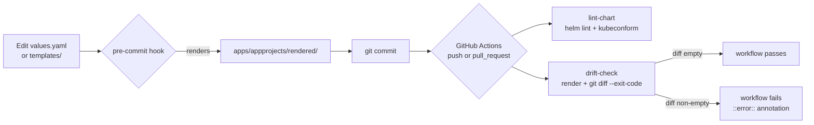

## Title

CI drift detection and pre-commit enforcement

> **Status:** Implemented
>
> **Date:** 2026-07-07
>
> **Author(s):** lakeops maintainers

## Overview

The rendered output pattern from
[SPEC-0001](0001-appproject-helm-chart-and-rendered-pattern.md) commits two
artifacts: the Helm chart source (`apps/appprojects/values.yaml`,
`Chart.yaml`, `templates/`) and the rendered output
(`apps/appprojects/rendered/*.yaml`). ArgoCD applies the rendered output,
not the chart. If the source changes without a re-render, ArgoCD silently
applies the stale manifest and the allowlist drift goes unnoticed.

Enforcement uses two layers. A local pre-commit hook
([`.pre-commit-config.yaml`](../../.pre-commit-config.yaml)) re-runs
`scripts/render-appprojects.sh` on every commit that touches the chart
source and stages the resulting diff into the same commit. A GitHub
Actions workflow
([`.github/workflows/lint.yaml`](../../.github/workflows/lint.yaml)) runs
two parallel jobs on every push to `main` and every pull request:
`lint-chart` (helm lint + kubeconform) and `drift-check` (re-render +
`git diff --exit-code`). The CI layer is the safety net for any local
bypass — a contributor without `pre-commit install`, a force-push, or a
hotfix applied through the GitHub web UI.

## Architecture

The two layers form a "local fast, CI definitive" pipeline.



Both layers call the same `scripts/render-appprojects.sh`. There is one
source of truth for the render pipeline; the local hook and the CI job
are two entry points into it.

## Components

| File | Role |
| --- | --- |
| [`.pre-commit-config.yaml`](../../.pre-commit-config.yaml) | Declares the local `render-appprojects` hook. Triggers on changes to `apps/appprojects/values.yaml`, `apps/appprojects/Chart.yaml`, or any file under `apps/appprojects/templates/`. The hook reuses `scripts/render-appprojects.sh`. Also scopes the standard `trailing-whitespace` and `end-of-file-fixer` hooks to exclude `apps/appprojects/rendered/` because the rendered YAML contains intentional trailing whitespace from Helm's `nindent`. |
| [`.github/workflows/lint.yaml`](../../.github/workflows/lint.yaml) | The CI workflow. Triggers on push to `main` and on every pull request. Two parallel jobs: `lint-chart` (installs Helm and `kubeconform`, runs `helm lint` then `helm template \| kubeconform -strict -summary -ignore-missing-schemas`) and `drift-check` (installs `coreutils` and `moreutils` for `csplit`, runs the render script, then `git diff --exit-code --stat apps/appprojects/rendered/`). On a non-empty diff, the `drift-check` job writes a `::error::` annotation pointing the contributor at the render command. |
| [`scripts/render-appprojects.sh`](../../scripts/render-appprojects.sh) | The render orchestrator shared by both layers. Idempotent: running it twice with no source change produces a byte-identical `rendered/` tree. `set -euo pipefail` ensures any failure aborts the hook or the CI job immediately. |

The local hook and the CI job differ in two respects. The local hook stages
its output back into the same commit; the CI job compares against the
committed tree and fails loudly if the local hook was bypassed. The CI
workflow also runs `lint-chart`, which the local hook does not — schema
validation is intentionally CI-only because it requires `kubeconform` and
takes seconds rather than milliseconds.

## Implementation

### Local hook activation

A one-time install on every workstation:

```bash
pip install pre-commit
pre-commit install
```

After install, every `git commit` that touches a chart-source file
re-runs the hook before the commit lands. If the hook fails, the commit is
aborted. To run the hook on demand against the whole repository:

```bash
pre-commit run --all-files
```

### File glob

The hook's `files` pattern is
`^apps/appprojects/(values\.yaml|Chart\.yaml|templates/.*)$`. This is a
deliberately tight match: it covers every file that can change the
rendered output and nothing else. The standard `trailing-whitespace` and
`end-of-file-fixer` hooks are configured with
`exclude: ^apps/appprojects/rendered/` so the rendered YAML's intentional
whitespace is not flagged.

### CI jobs

`lint-chart` is the structural and schema gate. It runs `helm lint` to
catch template syntax errors, missing required fields, and malformed
`toYaml` output, then `helm template | kubeconform` to validate every
emitted `AppProject` against the ArgoCD CRD schema. The `-strict` and
`-ignore-missing-schemas` flags keep kubeconform's output focused on the
AppProject CRD itself; missing CRD schemas for other resources do not
fail the job.

`drift-check` is the safety net. It installs `coreutils` and `moreutils`
via `apt-get` (the GitHub-hosted `ubuntu-latest` image ships with neither
by default), runs the render script, then runs
`git diff --exit-code --stat apps/appprojects/rendered/`. On failure the
job writes a `::error::` annotation and a `git diff --stat` so the
contributor can see which rendered file drifted. The two jobs are
independent: a `lint-chart` failure is a chart-source problem, a
`drift-check` failure is a workflow problem. They are reported as
separate PR checks so the contributor can tell at a glance which layer
caught the issue.

## Verification

### Local verification

A round-trip with the pre-commit hook installed proves the contract:

```bash
# Edit a benign field in values.yaml (e.g. a description)
git add apps/appprojects/values.yaml
git commit -m "test: pre-commit re-renders"
```

The commit must complete cleanly. The hook re-renders
`apps/appprojects/rendered/`, stages the diff, and the commit lands with
both `values.yaml` and the matching rendered file updated. Running
`git log -p --stat HEAD` shows both files in the same commit.

To verify the hook aborts on a broken template, introduce a syntax error in
`templates/appproject.yaml` and commit. The commit must be aborted with
the `helm template` error; `set -euo pipefail` at the top of the script
propagates the failure through the hook.

### CI verification

A pull request that bypasses the local hook (a contributor without
`pre-commit install` or an edit applied through the GitHub web UI)
triggers `drift-check` on the next push. The job must fail with the
`::error::` annotation and a red status on the PR. A separate push of a
branch with a malformed CRD field fails the `lint-chart` job on
`helm template | kubeconform`, regardless of whether the rendered files
are in sync.

### Combined check

Both layers can be exercised end-to-end on a clean tree:

```bash
bash scripts/render-appprojects.sh
git diff --exit-code --stat apps/appprojects/rendered/
helm lint apps/appprojects/
helm template apps/appprojects/ -s templates/appproject.yaml \
  | kubeconform -strict -summary -ignore-missing-schemas
```

All four commands must exit `0`. This is the exact check the CI workflow
runs, minus the runner-image setup.

## Known state

The `drift-check` job currently fails on `main` because
[`apps/appprojects/values.yaml`](../../apps/appprojects/values.yaml)
declares three duplicate `destinations` entries (one per environment —
dev, stage, prod), while the committed
[`apps/appprojects/rendered/*.yaml`](../../apps/appprojects/rendered/) files
contain a single entry. The drift is recorded in
[ADR-0006](../adr/0006-rendered-drift-ci-precommit.md) "Known state" and
[SPEC-0001](0001-appproject-helm-chart-and-rendered-pattern.md) "Known
state" so the resolution is reviewed on its own merits rather than fixed
silently.

Two valid resolutions:

1. **Collapse the values side.** Reduce `.Values.destinations` in
   `apps/appprojects/values.yaml` to a single `(server, namespace)`
   entry, matching the committed rendered output. The
   [`apps/appprojects/values.yaml`](../../apps/appprojects/values.yaml):9-10
   header comment notes the destinations list is intentionally
   per-environment (RFC-0001 §D4.6), so this is a deliberate change in
   policy.
2. **Expand the rendered side.** Re-run the render script and commit the
   resulting three-entry `destinations` block into all three rendered
   files. This matches
   [RFC-0001](../rfc/0001-destination-allowlist-uniformity.md) §Proposal
   item 2, which codifies a named `clusters` map for long-term
   multi-cluster support.

The fix is a separate code PR and is out of scope for this
documentation-only change. Until the fix lands, the `drift-check` job
will fail and the workflow status will reflect the known drift.

## References

- [ADR-0006 — CI drift-check + pre-commit hook](../adr/0006-rendered-drift-ci-precommit.md)
- [SPEC-0001 — AppProject Helm chart and rendered output contract](0001-appproject-helm-chart-and-rendered-pattern.md)
- [`.pre-commit-config.yaml`](../../.pre-commit-config.yaml)
- [`.github/workflows/lint.yaml`](../../.github/workflows/lint.yaml)
- [`scripts/render-appprojects.sh`](../../scripts/render-appprojects.sh)
- [RFC-0001 — Destination allowlist uniformity across AppProjects](../rfc/0001-destination-allowlist-uniformity.md)
